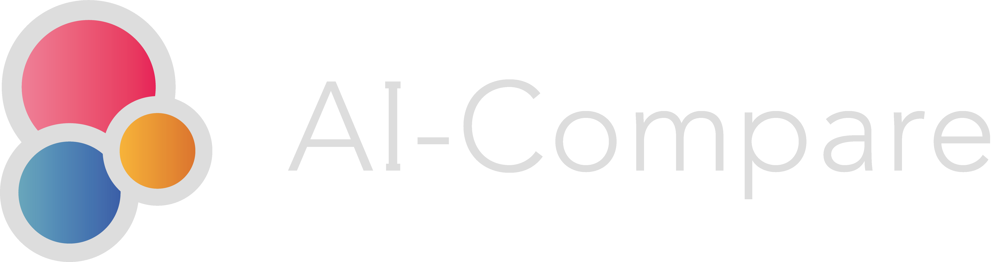

# Translation-API
## Description
This repositery provides code to implement [AI-Compare Translation API](https://www.ai-compare.com/text_apis/automatic_translation/). [AI-Compare Translation API](https://www.ai-compare.com/text_apis/automatic_translation/) allows to call Translation APIs from Google Cloud Platform Translate, AWS Translate, Microsoft Azure Cognitives Service Language, and IBM Watson Natural Language Translation. It permits to get results from these providers and compare the results.

## What is AI-Compare ?
[AI-Compare](https://www.ai-compare.com/) is a SaaS providing APIs connected to big (AWS, GCP, etc.) and small AI providers: [object detection](https://www.ai-compare.com/vision_apis/object_detection), [OCR](https://www.ai-compare.com/vision_apis/ocr), [NLP](https://www.ai-compare.com/text_apis/sentiment_analysis/), [speech-to-text](https://www.ai-compare.com/audio_apis/speech_recognition), custom vision, etc. Our solution allows users to compare the performance of these providers APIs according to their data and use them directly via our API thus offering great flexibility and making it very easy to change supplier. In particular, we offer better performance with the "Genius" feature that cleverly combines results from multiple providers.

AI-Compare offers 5000 free credits when you [create your account for free](https://www.ai-compare.com/accounts/login/?next=/my_apis). You can then use [APIs](https://documenter.getpostman.com/view/10011301/SzmiVFqh?version=latest#intro), use the [interface](https://www.ai-compare.com/my_apis), manage your account and have access to all the APIs.

You can find APIs documentation here : https://documenter.getpostman.com/view/10011301/SzmiVFqh?version=latest

## Usage
### Initialization
Enter your access token and select your API endpoint. You can get your token on your account manager [here](https://www.ai-compare.com/accounts/login/?next=/my_apis/my_account).
```python
import requests
headers = {  'x-access-token': 'Enter your API Key'}
url = 'https://www.ai-compare.com/api/v1/text/create/compare/automatic_translation'
```
### Select parameters 
Set your text, the source and target language, and providers APIs you want to run :
```python
payload = {'providers': '[\'ibm\', \'cognitives_service\', \'aws\', \'google_cloud\']','text_to_translate':'how are you today', 'source_language': 'en','target_language': 'fr'}
```
### Get results
```python
response = requests.request("POST", url, headers=headers, data = payload, files = files)
print(response.text.encode('utf8'))
```

## FAQ
Here you can access to AI-Compare [FAQ](https://www.ai-compare.com/faq/).

## Use cases
We provides on our website some [use cases examples for NLP APIs](https://www.ai-compare.com/use_cases_nlp/)

## Contact
If you have any question or request, you can contact us at contact@datagenius.fr

## Terms of use
You can access to our terms [here](https://www.ai-compare.com/terms/) on our website.


